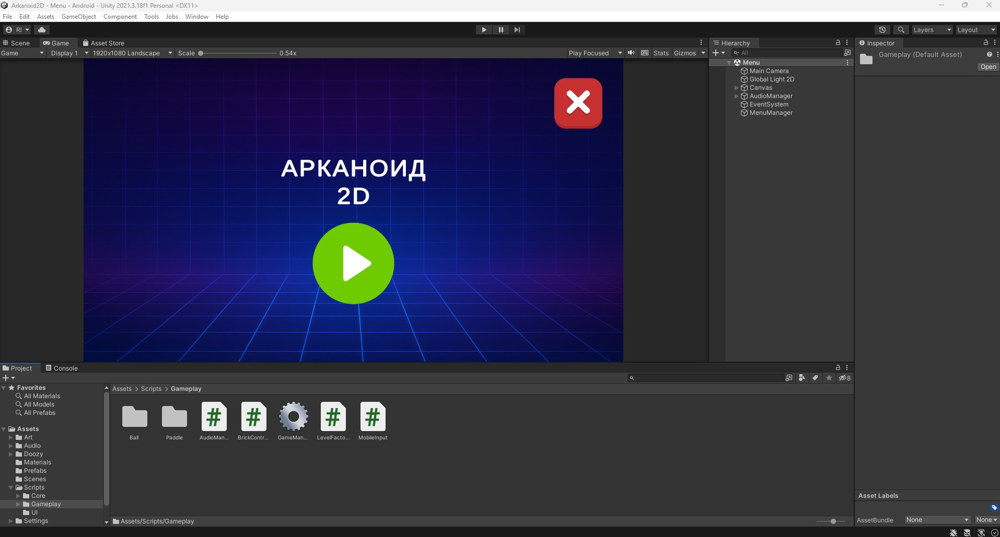
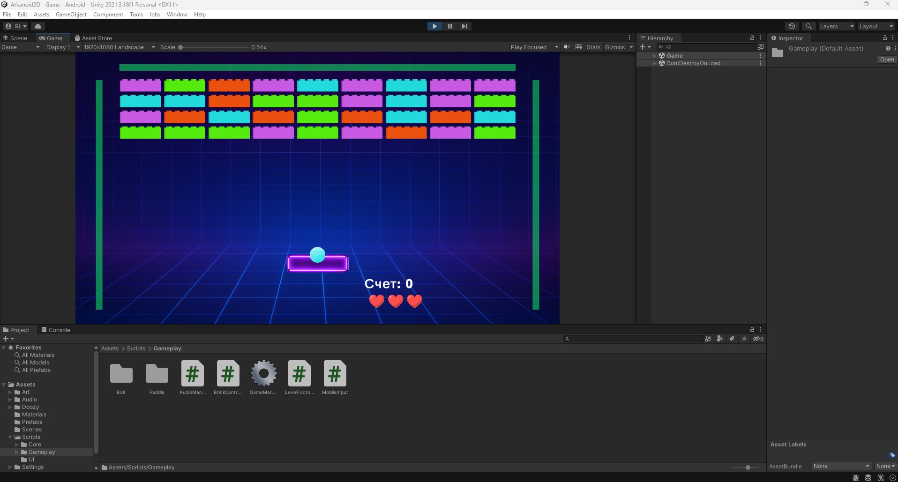
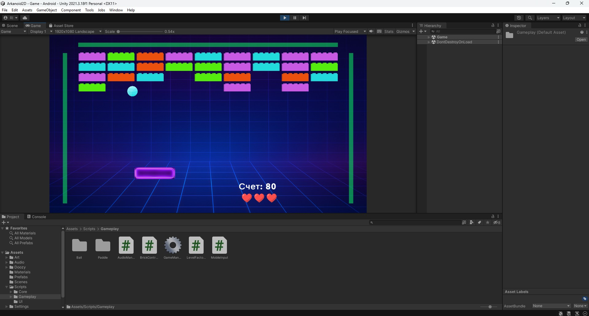
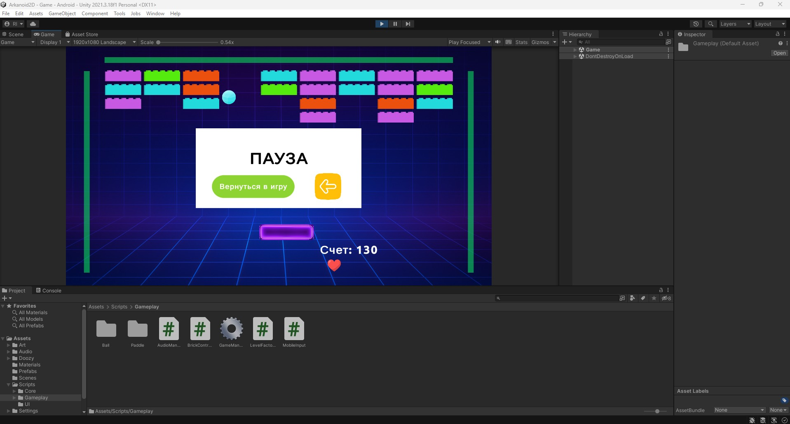
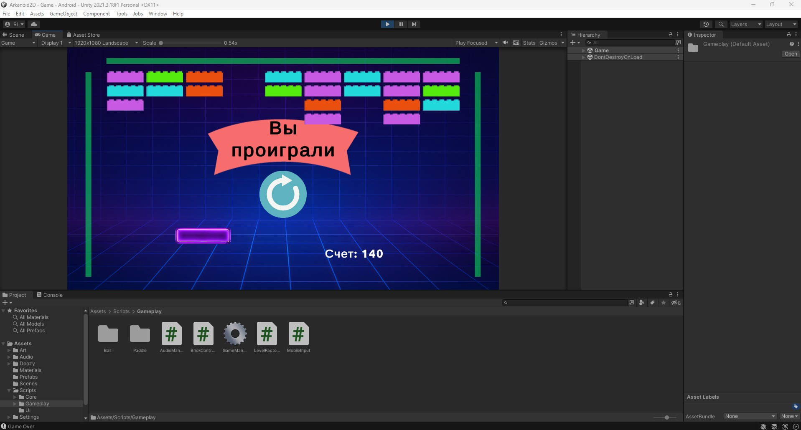

# 2D_Arkanoid
2D-игра в жанре Arkanoid / Breakout. Игрок управляет платформой, отражает мяч и уничтожает все кирпичи на уровне.
Unity 2021.3.18 + URP 2D  

**Особенности:**
- Классическая механика Arkanoid: мяч отскакивает от платформы, стен и кирпичей, игрок должен уничтожить все кирпичи;
- Разные типы кирпичей с разными очками и прочностью (hitPoints);
- Механика отскока мяча реализована через Rigidbody2D и Physics Material 2D;
- Система жизней: 3 жизни отображаются иконками, при потере жизни появляется новый мяч;
- Счёт: очки за уничтоженные кирпичи отображаются на HUD;
- Сетап уровня: LevelFactory генерирует сетку кирпичей на основе префабов;
- Звуковая система: фон, звук отскока, звук разрушения кирпичей;
- Управление: клавиши "← →" или "A/D" и запуск мяча ("Пробел"), пауза ("Esc") готовая система для мобильного управления;
- DoozyUI не используется, но интегрирован;
- GameManager управляет состоянием игры, обработкой событий и взаимодействием всех компонентов.

**TODO (на будущее):**
- Добавить разные уровни с прогрессивной сложностью;
- Визуальные эффекты разрушения кирпичей (частицы, анимации);
- Оптимизация под разные разрешения и соотношения экранов (Landscape).

**Примечание:**
- apk файл для установки находится в разделе "Build"

---

### Скриншоты

  

  

  

  

  

</table>
